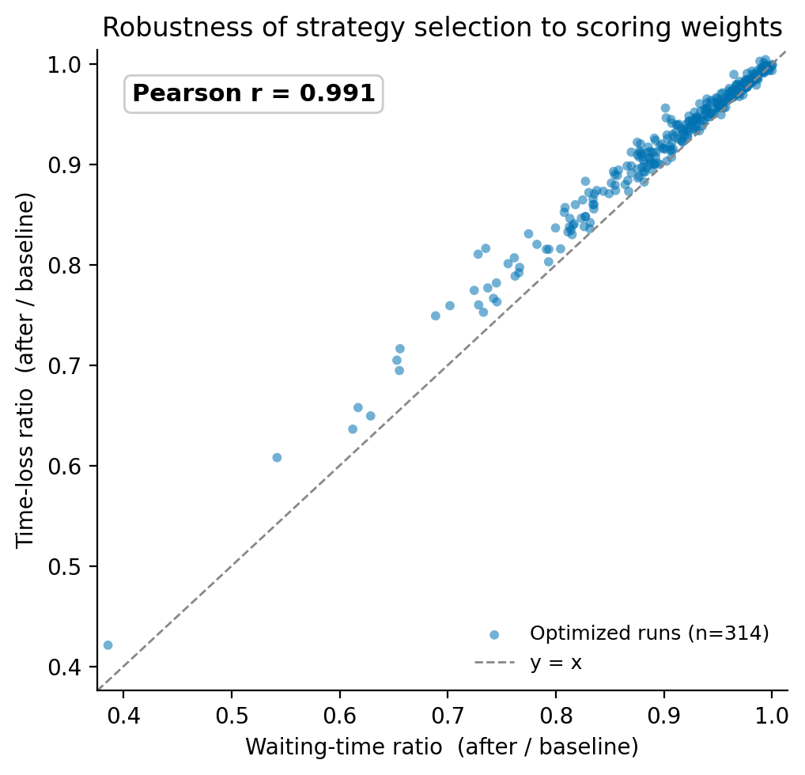

# 整合即時開放資料、短時預測與微觀模擬之可驗證動態號誌優化框架：以 SUMO 為驗證場域，並輔以大型語言模型解釋介面

**實務專題研究報告（修訂稿）**

- 專題編號：114-2-CSIE-S016
- 指導教授：陳香君
- 專題參與人員：112590060 伍紹文、112590045 邱兆偉、112590049 吳宜峰、112590048 劉柏漢

> 本修訂稿之所有統計數據均可由 `python tools/sensitivity_analysis.py` 重現，輸出於 `data/analysis/`。

---

## 中文摘要

本研究以國立臺北科技大學周邊路網為實驗區域，建構一套**可驗證、可解釋的多策略動態號誌優化框架** TrafficVision，整合即時開放資料、微觀交通模擬、短時車流預測與大型語言模型解釋介面。系統透過台北市 VD 開放資料取得即時車流，並以 SUMO 建立微觀模擬作為可重現的驗證場域；其核心為一條閉環決策流程：以雙通道 GRU 預測未來五分鐘各路段車流量與平均車速，再於多種號誌控制策略間並行模擬、加權選優，並對每個決策保留可追溯的依據。

在 406 次有效自動排程模擬中，框架選出的最佳策略相較無控制基準（路網內建固定時制）平均降低等待時間 8.6%、行程延誤 7.3%（配對檢定 *p* < .001）；改善隨壅塞加劇而上升，於高壅塞情境達 10.4%（前 25%）至 12.5%（前 10%）。須說明此改善係「五策略取優」相對於未經調校之人造基準。為嚴格定位框架效能，本研究另以兩項對照誠實檢驗：其一，與標準自適應基準 Max-Pressure 對照顯示，細粒度的 Max-Pressure 顯著優於本框架之粗粒度五策略選擇（平均行程延誤 38.1 vs 41.6 秒，*p* = 0.002）；其二，預測器消融顯示於五分鐘水平下端到端效益不僅未受益於 GRU，**以當前觀測（persistence）驅動反而略優且達顯著**（n = 60，*p* = 0.003，約 3.5%）。預測層方面，GRU pair model 於模擬 holdout 之車流通道平均絕對誤差較 persistence 基準改善約 58%（全 holdout，模型確實較佳），於有車路段之車速通道改善 87.7%（惟此侷限於活躍子集，全 holdout 之車速並不優於 persistence，見 4.6）；且此預測精度於目前的粗粒度選優中未能轉化為端到端優勢，GRU 的價值主要展現於有車路段之預測保真度與儀表板的預測視圖。

系統並以 React 與 Leaflet 儀表板呈現當前、預測與優化三種視角，另以本地部署之微調 Gemma 模型作為輔助解釋介面（僅作解釋、未參與決策）。整體而言，本研究的貢獻在於建立並驗證一條接真實即時開放資料、可重現、可解釋的閉環號誌決策框架，而非取得最佳控制效能；Max-Pressure 等細粒度控制器可作為候選策略納入此框架的選優集合。未來將導入圖神經網路建模路段間空間關聯、納入更細的策略空間與公平性指標，並評估與實際號誌控制器串接之可能。

**關鍵詞**：交通號誌控制、智慧交通系統、SUMO、GRU、即時開放資料、短時車流預測、大型語言模型

## ABSTRACT

This study develops TrafficVision, a **verifiable and interpretable multi-strategy framework for dynamic traffic-signal optimization** for the road network around National Taipei University of Technology, integrating real-time open data, microscopic simulation, short-term traffic prediction, and a large language model explanation interface. The system ingests vehicle-detector (VD) data from the Taipei City open-data platform and reconstructs demand in a SUMO microscopic simulation that serves as a reproducible testbed. Its core is a closed-loop decision process: a dual-channel GRU forecasts per-edge traffic volume and mean speed for the next five minutes, after which several signal-control strategies are simulated in parallel and selected by a weighted score, with a traceable rationale retained for every decision.

Across 406 valid auto-scheduled runs, the strategy selected by the framework lowers average waiting time by 8.6% and travel delay by 7.3% against an uncontrolled baseline (the network's built-in fixed timing; paired test *p* < .001), with the gain growing under congestion: 10.4% for the most-congested quartile and 12.5% for the top decile. This improvement is that of a "best-of-five-strategies" selection relative to an untuned, artificial baseline. To position the framework rigorously, we report two honest comparisons. First, against the standard adaptive baseline Max-Pressure (Varaiya, 2013), the fine-grained Max-Pressure controller significantly outperforms our coarse five-strategy selection (mean travel delay 38.1 vs 41.6 s, *p* = 0.002). Second, a predictor ablation shows that at the five-minute horizon the end-to-end result does not benefit from the GRU — a simple, training-free persistence baseline is in fact slightly but significantly better (n = 60, *p* = 0.003, ~3.5%). For prediction itself, the GRU pair model reduces flow-channel mean absolute error by ~58% on the full holdout (the model is genuinely better) and speed-channel error by 87.7% on active edges (this gain is confined to the active subset — on the full holdout the model does not beat persistence on speed; see §4.6); moreover this accuracy does not translate into end-to-end gain under the current coarse selection, so the GRU's value lies mainly in active-edge prediction fidelity and the dashboard's predictive view.

A React/Leaflet dashboard presents current, predicted, and optimized views, while a locally deployed fine-tuned Gemma model acts as an auxiliary interface that explains the decisions in natural language (explanation only; not part of the decision loop). The contribution of this work is the construction and verification of a reproducible, interpretable, closed-loop signal-decision framework grounded in real-time open data — not state-of-the-art control performance; controllers such as Max-Pressure can be incorporated as candidate strategies within the framework. Future work will incorporate graph neural networks for spatial dependency, a finer strategy space and fairness metrics, and assess integration with physical signal controllers.

**Keywords**: Traffic Signal Control, Intelligent Transportation System, SUMO, GRU, Real-Time Open Data, Short-Term Traffic Prediction, Large Language Model

---

## 第一章 緒論

### 1.1 研究背景

台灣都市化持續推進，道路機動車輛數與尖峰交通量逐年攀升，主要幹道於通勤時段經常壅塞，並連帶影響周邊巷道與交會路口的通行效率。都市交通壅塞不僅延長民眾通勤時間，也加劇能源消耗、空氣污染與交通安全風險。如何有效改善路口號誌控制，已是智慧城市發展的核心議題之一。

目前多數都市路口仍以固定時制號誌為主。固定時制設計簡單、維護容易、運作穩定，但難以即時反映短時間內的車流變化。車流量低時，固定秒數造成不必要的等待；車流量驟升時，既定綠燈又不足以消化車隊，導致排隊增長與路口回堵。在都會區道路密集、車流變動快速的情境下，固定時制已逐漸難以滿足即時管理需求。

隨著政府開放資料、交通感測設備、微觀交通模擬與人工智慧技術日益成熟，交通管理具備了從固定控制轉向資料驅動決策的條件。本研究以北科大周邊道路為實驗場域，整合台北市 VD 即時資料、SUMO 微觀模擬、GRU 短時車流預測與大型語言模型解釋介面，建構一套支援號誌優化的智慧決策系統。

### 1.2 研究動機

台北市已提供即時交通開放資料，涵蓋車速、車流量與道路狀態。然而這些資料若僅作靜態查詢或展示，難以直接轉換為號誌控制決策。交通管理人員調整號誌秒數時，多依賴現地觀察、歷史經驗與反覆測試，過程耗時且不易即時反應突發車流。

更關鍵的是兩個研究缺口。其一，在**短時車流預測**上，多數既有研究（如以 LSTM、GRU 建模者 [13]）在離線歷史資料集上評估準確度，較少將預測模型嵌入一條接真實即時資料、可持續運行的閉環流程；亦有研究在真實資料上預測車速 [14]，但多為獨立的預測任務，未與下游號誌控制串接。其二，在**號誌控制**上，近年深度強化學習方法（如 CoLight [9]、Van der Pol 與 Oliehoek [10]）展現潛力，但其決策過程偏向黑箱、需大量環境互動訓練，且如 Wei 等人的綜述所指出 [16]，其評估與可重現性仍具挑戰，導入實務時面臨可信度與可操作性問題。

因此本研究嘗試建立一套完整且可驗證的流程：從即時資料取得開始，經正規化與 SUMO 模擬，以 GRU 預測短時車流變化，再以多策略並行模擬比較不同號誌控制方式，最後以儀表板與 AI 解釋介面呈現結果，使系統不僅提出建議，也能說明建議的依據。

### 1.3 研究目的

本研究主要目的為開發並驗證一套整合即時交通資料、SUMO 模擬、GRU 車流預測與大型語言模型解釋介面的智慧號誌決策支援系統。具體目標如下：

1. 建置北科大周邊路網的 SUMO 微觀模擬環境，作為號誌策略的可驗證場域。
2. 串接台北市 VD 開放資料，建立即時車流的擷取、清理、範圍過濾與座標映射流程。
3. 以雙通道 GRU 模型預測未來五分鐘車流量與車速，提升系統對即時變化的預判能力。
4. 設計多種號誌控制策略，透過 SUMO 並行模擬比較等待時間、行程延誤等指標，並以加權分數選優。
5. 建構前端視覺化儀表板，呈現當前、預測與優化三種交通視角。
6. 導入微調之 Gemma 模型，作為輔助解釋介面，協助使用者理解系統分析結果。

本研究的核心研究問題為：**能否建立一套接入真實即時開放資料、可驗證且可解釋的閉環多策略號誌決策框架，於高壅塞情境下穩健地改善交通指標？而短時車流預測在此框架中扮演何種角色——是端到端效益的來源，抑或高保真的輔助元件？** 後一子問題將透過與當前觀測（persistence）基準的消融予以誠實檢驗（見第五章）。

### 1.4 研究範圍

本研究以北科大周邊道路為主要實驗範圍，涵蓋市民大道、八德路、忠孝東路及新生南路等主要路段。研究路網包含約 230 條 SUMO edge（其中約 120 條為命名道路 edge，其餘為內部 junction edge）與 17 個受號誌控制路口。資料來源主要為台北市 VD 開放資料，並以 SUMO 模擬生成車流與號誌控制結果。

本研究聚焦於模擬環境中的號誌策略評估與決策支援，**尚未直接控制真實交通號誌設備**。因此研究成果定位為實際導入前的模擬驗證平台，協助後續評估不同策略在實務場域的可行性。

### 1.5 研究貢獻

本研究的核心貢獻為一套**可驗證、可解釋的多策略動態號誌優化框架**，其餘貢獻為支撐此框架的元件與管線。依重要性排序如下：

1. **可驗證、可解釋的多策略號誌選擇框架**：以顯式多策略並行模擬與加權評分取代黑箱學習，每個決策皆可追溯、可重現；並透過權重敏感度分析、配對統計檢定與一個標準自適應基準（Max-Pressure）對照，系統性檢驗其行為，與 RL 黑箱控制 [16] 形成差異化。此為本研究的主軸。
2. **接真實即時開放資料的閉環自動化管線**：建立每五分鐘自動執行「擷取—模擬—預測—選優—呈現」的可運行流程，使上述框架得以在真實資料條件下持續運作。
3. **雙通道短時預測元件（輔助）**：提出同時預測車流量與平均車速的 GRU pair model，於模擬 holdout 之車流通道 MAE 較 persistence 基準改善約 58%（全 holdout，模型確實較佳）、有車路段之車速通道改善 87.7%（侷限活躍子集，全 holdout 不優於 persistence，見 4.6），作為框架的預測輸入與儀表板的預測視圖。須誠實指出，預測器消融顯示於目前五分鐘、五策略的設定下，框架的端到端效益並未受益於 GRU——以簡單的 persistence 驅動反而略優且達顯著（見 5.11），故 GRU 定位為高保真的輔助元件而非端到端增益的來源。
4. **三視角視覺化與 LLM 輔助解釋（輔助）**：以儀表板與自然語言介面提升系統結果的可視性與可理解性；LLM 僅作解釋，未參與決策或自動排程。

---

## 第二章 文獻回顧與技術基礎

本章依「號誌控制演進 → 短時車流預測 → 模擬與資料基礎 → 解釋介面」的順序回顧相關研究，並於每一節結尾指出對應的研究缺口，最後於 2.6 綜合收斂為本研究的定位。

### 2.1 智慧城市交通號誌控制

交通號誌控制歷經固定時制、感應式控制、自適應控制，以至近年的 AI 輔助控制。固定時制依歷史交通量預設週期與綠燈秒數，適合流量穩定的情境，但在車流高度變動時難以即時反映。感應式控制依車輛偵測調整綠燈，自適應控制進一步依整體路網狀態動態調整 [8]。近年研究導入深度與強化學習，使系統能自動學習控制策略，如 CoLight 以注意力機制協調路網層級的合作 [9]，Van der Pol 與 Oliehoek 探討多號誌的協調學習 [10]。

**缺口**：如 Wei 等人的綜述所整理 [16]，強化學習號誌控制雖成果豐碩，但決策過程偏黑箱、需大量訓練，且其評估環境與可重現性仍具挑戰。近年雖有研究朝可解釋方向發展，如 Ault 等人以多項式函數學習可解釋的號誌控制策略 [17]、Hu 等人以注意力機制與反事實分析提升決策可解釋性 [18]，但多數仍需強化學習訓練，且未與真實開放資料的閉環串接。這指向本研究的差異化方向——**可驗證、可解釋且接真實即時資料**的控制流程。

### 2.2 短時車流預測與 GRU 模型

短時車流預測旨在依近期交通狀態推估未來數分鐘的變化。交通流量具時間序列特性，受通勤尖峰、道路容量、號誌週期與周邊互動影響，適合以循環神經網路建模。GRU [1] 透過門控機制保留重要時間資訊、降低長序列訓練困難，相較傳統 RNN 參數較少、訓練較有效率。Fu 等人率先將 LSTM 與 GRU 用於短時車流預測，證明其優於 ARIMA [13]。

**缺口**：Fu 等人 [13] 在 PeMS 等離線歷史資料集上評估；Elmi 與 Tan 雖在真實道路資料上預測車速 [14]，但屬獨立預測任務，未與號誌控制串接。本研究則將雙通道（車流＋車速）GRU 嵌入一條接真實即時 VD 的閉環，並以預測結果驅動下游號誌選優。

### 2.3 都市交通模擬與 SUMO

SUMO（Simulation of Urban Mobility）為開源微觀交通模擬工具 [2]，可模擬車輛、行人、道路與號誌行為。相較於在真實道路測試控制策略，SUMO 能在不影響交通安全的前提下進行多策略比較與效能分析。SUMO 支援由 OpenStreetMap 匯入路網 [11]，並以 trip、route 檔設定車流需求 [12]；其 TraCI 介面可於模擬中即時取得車輛位置、速度、路段密度、號誌相位等資訊，並動態修改控制參數。

**缺口／定位**：模擬讓「可驗證」成為可能——本研究正是利用 SUMO 作為號誌策略的可重現驗證場域。

### 2.4 即時開放資料與資料處理

政府開放資料提供即時道路速率、車流量與狀態，是智慧交通系統的重要來源。然而開放資料涵蓋範圍廣、格式不一定對應特定模擬場域，需經清理、範圍過濾、座標轉換與道路對應等前處理。本研究使用台北市交通局 VD 開放資料 [3]；由於 API 回傳座標採 WGS84 經緯度，而 SUMO 使用自身座標系，需進行座標映射。

**缺口／定位**：開放資料讓「接真實即時」成為可能，但 VD 僅提供偵測點的流量與速度，**不含起迄（OD）需求**，因此模擬需求須由可得資料重建（詳見 3.4）。此為本研究流程的前提，亦為其限制之一。

### 2.5 大型語言模型與決策說明

大型語言模型在本研究中**不負責號誌數值優化**，而是作為系統輸出的自然語言解釋介面。其功能為根據後端產生的結構化資料，將交通狀態、壅塞原因、號誌調整邏輯與預期改善轉換為易懂文字。本研究使用 Ollama 作為本地推論服務 [7]，並導入微調之 Gemma 模型 [4]。本地化部署可降低外部網路依賴，並讓回答以系統資料為依據，避免模型臆測交通決策。

**缺口／定位**：相較於黑箱模型，解釋介面補上「可解釋」這一塊；惟其角色為輔助，未納入自動決策流程（詳見 4.9）。

### 2.6 綜合與研究定位

綜合上述，既有研究在四個面向各有侷限：強化學習號誌控制難驗證、難解釋 [16]；短時預測多在離線資料上評估 [13] 或未與控制串接 [14]；GRU 僅捕捉時間維度，缺乏路段間空間依賴 [15]。換言之，**尚無研究將「接真實即時資料的閉環、可驗證且可解釋的多策略選擇優化、可解釋介面」整合為一條完整流程**。本研究即補上此缺口，並以可重現的方式驗證其效益。

---

## 第三章 研究方法與系統架構

本章說明系統各設計選擇的「為什麼」；具體實作步驟與參數見第四章。

### 3.1 系統設計理念

本研究採「資料監測—模擬驗證—預測分析—策略評估—互動呈現」的設計理念。系統不僅顯示即時路況，更將即時資料轉換為 SUMO 模擬需求，以 GRU 預測未來車流，並比較多種號誌策略的效能，最後於儀表板呈現並由 AI 助理解釋。TrafficVision 並非單一模型，而是一套完整的決策支援流程，使管理者能從「目前發生什麼」「接下來可能發生什麼」「如何調整較有效」三個層面理解交通狀態。

### 3.2 系統整體流程

系統分為兩條資料流。第一條為即時 VD 資料流，定期抓取台北市車流資料，將當前車速、流量與壅塞等級呈現於儀表板。第二條為完整 ML 管線，依序執行資料抓取、正規化、路徑生成、SUMO 模擬、GRU 預測、號誌策略評估與結果輸出。排程器每五分鐘觸發一次，使儀表板維持與實況接近的狀態。

> **【請於此插入圖片：系統整體架構流程圖（兩條資料流：即時 VD 流 + 完整 ML 管線）】**

*圖 3.1　系統整體架構流程圖。*

### 3.3 資料取得與正規化方法

VD 原始資料涵蓋範圍大於研究區域，系統先依研究邊界進行範圍過濾。由於 API 座標採 WGS84 經緯度，無法直接對應 SUMO 座標系，本研究**選擇線性轉換**將經緯度映射至 SUMO 地圖座標。此選擇的理由在於研究範圍不大，線性映射的誤差在可接受範圍內，且實作簡單、計算成本低；轉換後再以最近路口比對修正落在範圍外的端點，降低資料與路網不一致的誤差。

### 3.4 路徑生成與模擬建置

VD 提供偵測點的流量與速度，不含 OD 需求，因此旅次需求須由可得資料**合成重建**。系統先產生 trip 需求，再以 SUMO 的 duarouter 計算路徑。由於單次 duarouter 通常產生單一最佳路徑，若所有車流集中於同一路徑會降低模擬真實性，故本研究採迭代方式生成多組候選路徑並加入隨機化權重，使車流分布更接近實際。

此處須誠實界定：合成需求並非測量所得的真實 OD，而是在開放資料限制下的最佳重建。為確保策略比較的公平性，**單次模擬內所有策略共用同一份需求與路徑**；隨機化僅發生於不同模擬（不同時段快照）之間，本即應有差異。需求保真度為本研究的限制之一（見 6.3）。

### 3.5 GRU 車流預測方法

本研究以 GRU pair model 預測未來五分鐘交通狀態。**選擇 GRU 而非 LSTM** 的理由為其門控結構較精簡、參數較少、訓練效率較佳，於本研究的資料規模下已足夠捕捉時間趨勢 [1][13]。**採雙通道（車流量＋平均車速）** 的理由為號誌策略評估同時關注流量壓力與速度狀態，單一通道不足以刻畫壅塞。模型輸入為近期 15 個 timestep（每步 20 秒）之路段車流量、平均車速與時間特徵（sin/cos 編碼之日內時間、距上次抓取之 gap_minutes），輸出為未來 15 個 timestep 之雙通道預測。在高流量路段，車流變化較易造成回堵，故模型設計與評估特別重視高流量路段的預測準確性。

### 3.6 號誌策略評估方法

本研究設計多種策略並行模擬比較，包含無控制基準、依原始週期之固定時制、依壅塞調整之策略，以及依預測車流調整綠燈的 adaptive 策略。**評分採兩層設計**：第一層以啟發式 predicted_score 依預測壅塞樣態預先排序候選策略，第二層以 SUMO 實際模擬計算綜合分數。綜合分數定義為

```
composite = 0.6 × (等待時間 / 基準等待時間) + 0.4 × (行程延誤 / 基準行程延誤)，越低越佳
```

**選擇 0.6 / 0.4 而非其他配比**，是經實驗試調後選定，略偏重停等舒緩。此權重設定的穩健性已透過敏感度分析驗證（見 5.8），故非結果之關鍵假設。

### 3.7 儀表板與 AI 互動介面

前端以 React 建構，並以 Leaflet 疊加 SUMO 路網與真實座標，呈現熱力圖、車流狀態與策略評估結果。AI 介面以微調之 Gemma 作為問答模型，透過 Ollama 本地部署。**此處的設計選擇是讓 LLM 僅負責「解釋」而非「決策」**：其回答以後端即時資料與模擬結果為依據，避免模型臆測，藉此提升可追溯性與可信度。

---

## 第四章 系統實作

本章說明各模組的實際實作與參數，對應第三章的設計理由。

### 4.1 地圖生成與路網修正

本研究以 SUMO 的 OSMWebWizard 由 OpenStreetMap 匯入北科大周邊路網 [11]。初始地圖雖能快速建立結構，但可能存在節點、車道、轉向連接與號誌設定不一致，故於匯入後檢視並修正，使路網更接近實際。模擬範圍涵蓋市民大道、八德路、忠孝東路與新生南路等主要路段，具多路口、幹道與支線交會的特性，適合作為動態號誌控制的模擬場域。

> **【請於此插入圖片：SUMO-GUI 模擬路網畫面（北科大周邊）】**

*圖 4.1　SUMO 模擬路網畫面。*

### 4.2 API 即時車流資料擷取

系統透過台北市交通資料開放平台取得 VD 即時資料 [3]，由排程器每五分鐘呼叫一次 API，取得研究範圍周邊的車速、流量與道路狀態。擷取後先進行格式檢查與範圍篩選，剔除無關資料，再轉換為 SUMO 模擬輸入。

### 4.3 資料正規化與座標映射

座標映射先取得研究區域的最小／最大經緯度，再依 SUMO 地圖在 X、Y 方向之長度比例縮放。映射完成後檢查路段端點是否位於模擬範圍內；若不吻合，則以最近路口比對方式修正。

### 4.4 車流路徑生成

取得起迄資料後，系統產生 trip.xml 作為旅次輸入，並以 duarouter 轉為 route 檔 [12]。路徑生成採多次迭代並加入 `--weights.random-factor 12` 的隨機化權重，使車輛路線更具多樣性。需注意此隨機化目前未固定亂數種子，故單次模擬的路徑無法逐筆重現（見 6.3）。

### 4.5 SUMO 模擬與 TraCI 資料擷取

完成路網與路徑設定後，系統於 SUMO 建立完整模擬環境，並透過 TraCI 擷取車輛位置、速度、加速度、路段密度、平均速度、號誌相位與倒數時間等。這些資料一方面供儀表板呈現即時狀態，另一方面作為 GRU 預測與號誌評估的基礎。

### 4.6 GRU 模型訓練與預測

GRU 模型以 SUMO 微觀模擬產生的多日車流時間序列為訓練資料（約 1.9 萬筆訓練樣本、5 千筆 holdout 測試樣本）。模型採雙層 GRU（hidden_dim = 256, num_layers = 2）加上 attention 池化與全連接解碼層；輸入維度為 230 × 2 + 3，輸出維度為 230 × 2（15 個 timestep × 2 個通道）。前處理以 Log1pScaler 對車流量與車速同步正規化，避免高流量路段主導損失。損失函數採加權序列損失：車流通道於高流量 cells（target > log1p(10)）給予 5× 權重；車速通道採 has-vehicle mask，僅對 target count > 0 的 cells 計算 MSE，避免 dense matrix 中 fillna(0) 之假零稀釋訊號。兩通道 loss 以 speed_loss_weight = 0.5 加權相加。訓練於 NVIDIA RTX 4060 Ti 執行，epochs 上限 60、early stopping patience = 8，於第 17 epoch 達最佳 validation loss 0.0930。

Holdout 測試結果（20,005 對樣本）需區分兩個通道誠實呈現：

**車流通道（全 holdout，模型確實優於基準）**：模型 MAE 為 0.129，相較 persistence baseline（0.309）改善 **58.2%**、相較 zero baseline（0.482）好 3.7 倍，且於 15 個預測步逐步皆勝出；高流量路段（target > 10 輛/步）MAE 為 0.779，相較 persistence（2.27）改善 **65.6%**。此為**整體 holdout（含空、佔用 cell）**的結果，反映模型確實學到車流的時間演化。

**車速通道（須限定條件解讀）**：於有車（活躍）路段（target > 20 km/h），模型 MAE 為 3.78 km/h，相較 persistence（30.73）改善 87.7%。**惟此數字須誠實設限**：(1) 車速通道採 has-vehicle mask 訓練（僅監督有車 cell），模型並未被要求在空 cell 輸出零速，故於**全 holdout（含空 cell）其車速 MAE 約 14 km/h、反而高於 persistence 約 5.6 km/h**；(2) persistence 於活躍路段的 30.73 km/h 誤差，部分源於密集矩陣對「上一時窗為空、本時窗剛佔用」cell 以零填充，使 persistence 預測 0 而誤差被放大。因此車速通道的 87.7% 應理解為「**在有車路段、相對於零填充式 persistence**」的改善，而非無條件的準確度優勢；此亦與 5.11 的端到端發現一致——車速優勢侷限於特定子集，未能轉化為端到端增益。

上述準確度均在**模擬域的 holdout** 上評估，反映模型對 SUMO 生成序列的預測能力，而非對真實道路的直接驗證（見 6.3）。本段數字可由 `python test_model.py`（車流通道）與 `python eval_speed_holdout.py`（車速通道）重現。

### 4.7 號誌控制策略與加權評分

系統並行評估多種策略，每種皆於相同模擬條件下執行，記錄等待時間、行程延誤與其他指標，再轉為加權分數比較。其中 adaptive 策略依預測車流與壅塞程度，鎖定關鍵路口並動態延長綠燈秒數，目的在於於高流量方向提供較多通行時間，降低車隊累積與回堵。第一層 predicted_score 以「策略激進程度與當前壅塞比的契合度」為主，先篩出候選；第二層再以 SUMO 實測之綜合分數選優。

adaptive 策略的參數並非固定，而是依本輪 GRU 預測即時生成，其邏輯如演算法 1：

```
演算法 1：adaptive 策略參數生成
輸入：本輪 GRU 預測結果
1: 由預測計算壅塞輪廓
     cr  ← congestion_ratio    // 壅塞 edge 佔比，0..1
     tvr ← temporal_ratio      // 時間軸車流變異程度，0..1
2: 依壅塞程度動態設定參數
     top_n_tls         ← 3 + round(cr × 3)          // 受控路口數，3..6
     proportional_pool ← 5.0 + cr × 5.0             // 綠燈分配池，5..10
     top_edge_count    ← 12 + round(cr × 12)        // 監控 edge 數，12..24
     update_interval   ← max(60, 180 − tvr × 120)   // 更新間隔(秒)，60..180
3: 以上述參數組成 adaptive 策略，與其餘候選一同送入 SUMO 評估
4: 依綜合分數（0.6×等待 + 0.4×延誤）選出最佳策略
```

其設計直覺為：壅塞越嚴重（cr 越大），則控制越多路口、分配越多綠燈、監控越多路段；車流時間變異越大（tvr 越大），則縮短更新間隔，使號誌更頻繁響應當下變化。

為使產生的號誌計畫符合基本的可部署性，策略覆寫並非任意改寫相位，而是在既有相位結構上施加下列實體安全下限（於 `tools/traffic_optimizer_signal.py` 強制，並可由環境變數覆寫）：最小綠燈 5 秒（`TRAFFICVISION_MIN_GREEN`）、最小黃燈清道 3 秒（`TRAFFICVISION_MIN_YELLOW`）、最小全紅淨空 1 秒（`TRAFFICVISION_MIN_ALL_RED`）。任何低於下限的相位會被夾回下限，以避免 SUMO 中的非法相位切換與車輛無安全清道時間。須誠實界定其邊界：本系統沿用路網檔原有的相位序列（含其行人通行與清道相位）僅調整綠燈秒數的分配，**並未針對行人專用相位進行獨立優化或新增行人保護相位**；對行人需求較高的路口，實務部署時應加入行人最短綠燈與專用相位約束（列為限制，見 6.3）。

### 4.8 前端儀表板實作

前端以 React 建構單頁式應用，搭配 Leaflet 呈現地圖視覺化 [6]。儀表板提供三種視角：當前車流狀態、GRU 預測狀態、優化後狀態，協助使用者快速比較並理解號誌優化對路網的影響。

> **【請於此插入圖片：TrafficVision 前端儀表板畫面】**

*圖 4.2　TrafficVision 儀表板畫面。*

### 4.9 AI 問答介面實作

AI 問答介面以 Ollama 作為本地推論伺服器 [7]，部署微調之 Gemma 模型 [4]。本研究以 Unsloth 框架對 Gemma 進行 LoRA 微調，訓練資料由系統實際運行之 handoff 數據（含策略選擇、加權分數、預測結果）配對人工撰寫之解釋構成，微調後以 export_to_gguf 轉為 GGUF 格式部署。須誠實說明：**此 AI 問答介面目前為互動式 demo，由使用者於儀表板即時查詢，尚未納入每五分鐘的自動排程流程**；其定位為輔助解釋，而非決策核心。

---

## 第五章 實驗設計與結果分析

### 5.1 實驗場域

實驗以北科大周邊道路為場域，路網涵蓋市民大道、八德路、忠孝東路與新生南路等主要道路，含約 230 條 SUMO edge 與 17 個受號誌控制路口。此區道路密集、路口眾多，且位於市中心交通流量較高之區域，適合作為智慧號誌控制的驗證場域。

### 5.2 實驗情境與資料規模

系統以 SUMO 建立微觀模擬，並以即時 VD 與模擬生成資料建立不同流量條件。本章結果彙整自 2026 年 5 月期間的自動排程模擬：共 468 次執行紀錄，其中 62 次因即時資料長度不足（少於 GRU 所需的 15 個 timestep）而跳過，得 **406 次有效模擬**（以 `data/runtime_data/_metrics.jsonl` 之有效紀錄為宇集，全章分析均以此為準）。各策略皆於相同路網、相同需求與相同模擬條件下執行，以確保比較一致。

### 5.3 評估指標

本研究記錄並比較下列六項指標：平均等待時間、行程延誤、平均行程時間、出發延誤、模擬結束時間與車輛 teleport 次數。其中**平均等待時間與行程延誤為加權評分的核心指標**（權重 0.6／0.4），其餘為輔助觀察指標。所有指標均以「無控制基準」與「最佳策略」逐次比對後彙整。

### 5.4 號誌策略比較

本研究比較五種策略：無控制基準（no_control，號誌維持路網檔內建之原始固定時制、不施加優化）、baseline_original、baseline_more_edges、baseline_more_edges_more_tls，以及結合 GRU 預測的 adaptive。須說明 no_control 為「不優化的現況」基準，而非「號誌全關」；各 baseline 策略則以不同積極程度施加號誌覆寫。在 406 次有效模擬中，各策略獲選為最佳的次數為：baseline_more_edges_more_tls 96 次（23.6%）、no_control 92 次（22.7%）、adaptive 90 次（22.2%）、baseline_original 70 次（17.2%）、baseline_more_edges 58 次（14.3%）。

### 5.5 模擬車速保真度檢核

為初步檢核 SUMO 模擬是否反映真實路況，本研究以同期 VD 快照比較主要幹道的真實車速與模擬車速（模擬車速取有車 edge 之平均）。如表 5.1，五條主要幹道的模擬車速與 VD 車速高度相關（Pearson *r* = 0.895，平均絕對差 2.3 km/h）：市民大道、八德路、忠孝東路三條幹道差距均在 1 km/h 內；新生南路與建國高架差距較大（+4.3、−6.1 km/h），推測與該路段車流合成密度的差異有關。須說明此為**車速層級、單一同期快照、路名級彙整**之檢核，而非流量層級驗證——VD 為通過量、SUMO 為快照和，單位族不同，無法直接比較流量。

**表 5.1　主要幹道：真實 VD 車速 vs 模擬車速（同期快照）**

| 主要幹道 | VD 車速 (km/h) | 模擬車速 (km/h) | 差異 |
|---|---:|---:|---:|
| 市民大道 | 32.3 | 33.1 | +0.8 |
| 八德路 | 41.9 | 41.7 | −0.3 |
| 忠孝東路 | 44.5 | 44.4 | −0.1 |
| 新生南路 | 46.5 | 50.8 | +4.3 |
| 建國高架 | 38.6 | 32.5 | −6.1 |

> 註：Pearson *r* = 0.895，平均絕對差 2.3 km/h。模擬車速取自有車 edge 之平均，依路名彙整至主要幹道。此檢核支持模擬於車速層級反映真實路況，惟需求（流量）保真度仍為限制（見 6.3）。

### 5.6 整體結果

表 5.2 彙整最佳策略相較無控制基準的六項指標改善。此處「最佳策略」指**該次模擬中五種候選策略內綜合分數最低者**（即對策略集合的逐次選優），「無控制基準」則為**路網檔內建之原始固定時制、不施加任何優化**，並非交通局實際部署之號誌時制。系統最佳策略平均降低等待時間 8.6%、行程延誤 7.3%，改善經配對 Wilcoxon 檢定具統計顯著性（*p* < .001，Cohen *d* = 0.48）。teleport 次數由平均 1.93 降至 1.24；惟須中性看待——teleport 為 SUMO 在車輛長時間卡滯（預設逾 300 秒）時的強制脫困機制，其下降反映嚴重壅塞鎖死情形減少，屬**模擬內部指標**而非真實交通效益，故僅列為輔助觀察（見 5.3），不計入加權評分。

**表 5.2　各指標：無控制基準 vs 最佳策略平均（n = 406）**

| 評估項目 | 無控制基準 | 最佳策略平均 | 改善幅度 |
|---|---:|---:|---:|
| 平均等待時間 (s) | 39.03 | 35.66 | −8.6% |
| 行程延誤 (s) | 47.87 | 44.35 | −7.3% |
| 平均行程時間 (s) | 61.99 | 58.47 | −5.7% |
| 出發延誤 (s) | 29.70 | 28.98 | −2.4% |
| 模擬結束時間 (s) | 1404.24 | 1336.09 | −4.9% |
| 車輛 teleport 次數（模擬指標） | 1.93 | 1.24 | −36.0% |

> **【請於此插入圖片：當前／預測／優化三種視角之車流熱力圖】**

*圖 5.1　當前、預測與優化三種視角之車流熱力圖。*

### 5.7 壅塞分層分析

為檢驗「高壅塞情境下效益更大」的主張，本研究以無控制基準的平均等待時間作為壅塞代理，將 406 次模擬分層。表 5.3 顯示改善幅度隨壅塞加劇而單調上升：高壅塞前 25%（等待 ≥ 51.4 秒）等待改善達 10.4%，前 10%（≥ 76.1 秒）達 12.5%。同時，高壅塞時「無控制」獲選為最佳的比例由整體的 22.7% 降至前 10% 的 4.9%，顯示車流越壅塞，動態介入越能勝過維持現狀。（全文壅塞改善幅度統一以一位小數表示：等待 8.6%／10.4%／12.5%。）

**表 5.3　不同壅塞程度下之改善幅度**

| 壅塞分層 | 樣本數 | 等待時間改善 | 行程延誤改善 | 無控制獲選率 |
|---|---:|---:|---:|---:|
| 全體 | 406 | 8.6% | 7.3% | 22.7% |
| 高壅塞 前25%（等待 ≥ 51.4 s） | 102 | 10.4% | 9.4% | 14.7% |
| 高壅塞 前10%（等待 ≥ 76.1 s） | 41 | 12.5% | 11.4% | 4.9% |

須留意此趨勢亦可能部分受迴歸均值影響（基準越極端、回落空間越大），惟「無控制獲選率隨壅塞顯著下降」較難以迴歸均值解釋，支持動態介入於壅塞時確有價值。

### 5.8 權重敏感度分析

為檢驗綜合評分權重對策略選擇的影響，本研究利用各策略子目錄保存的逐策略指標，於 w_wait ∈ {0.5, 0.6, 0.7} 下重算各策略之綜合分數並重新選優。結果顯示等待時間改善與行程延誤改善高度相關（Pearson *r* = 0.991，見圖 5.2），故權重變動對選擇影響極小：三組權重下，最佳策略完全一致者達 98.8%（401/406）；由 0.6/0.4 調至 0.7/0.3 僅 0.3% 決策反轉。此結果顯示策略選擇對權重設定穩健，0.6/0.4 並非關鍵假設。



*圖 5.2　號誌策略選擇對評分權重之穩健性。橫軸為勝出策略之等待時間比（優化後/基準），縱軸為行程延誤比；每點為一次由非基準策略勝出之模擬（n = 314）。Pearson r = 0.991。*

### 5.9 逐情境選擇 vs 固定單一策略

本節量化「依情境選擇策略」相對於「永遠承諾單一策略」的一致性增益。表 5.4 以平均行程延誤比較兩者：任何單一固定策略的平均行程延誤約為 46.70 秒（最佳固定策略 baseline_more_edges_more_tls），而逐情境選擇達 44.35 秒，於 74.9%（304/406）的情境中優於最佳固定策略，配對 Wilcoxon *p* ≈ 3.1×10⁻⁵²。

須對此結果的強度誠實設限：本系統的選擇是在每次模擬中挑出五個候選裡綜合分數最低者，因此「逐情境選擇優於任一固定策略」在設計上幾近必然成立——選擇者擁有嚴格更多的自由度。此處的數值並非令人意外的實證發現，而是**對「為每個情境選對策略」相較「鎖定單一策略」之一致性優勢的量化**；之所以不是 100% 勝出（而是 74.9%），是因為選擇所用的指標（綜合分數 = 0.6×等待 + 0.4×延誤）與此處比較的指標（行程延誤）不同。其統計顯著性 *p* 值極小亦非意外，而是上述構造的必然推論，不應解讀為強烈的實證發現。換言之，本節支持「逐情境選擇有其價值」，但不應被當作本研究的主要證據；框架的價值定位另見 5.10 與標準自適應基準的對照、以及 5.11 對預測器角色的釐清。

**表 5.4　逐情境選擇 vs 永遠固定單一策略（指標：平均行程延誤，n = 406）**

| 控制方式 | 平均行程延誤 (s) |
|---|---:|
| 永遠固定 baseline_more_edges_more_tls（最佳固定策略） | 46.70 |
| 永遠固定 baseline_more_edges | 46.70 |
| 永遠固定 adaptive | 46.91 |
| 永遠固定 baseline_original | 46.95 |
| 無控制（no_control） | 47.87 |
| **逐情境之動態選擇** | **44.35** |

### 5.10 與標準自適應基準（Max-Pressure）之對照

前述比較對象為 persistence 與本研究手刻之固定策略；為更嚴格地定位本框架，本節再納入交通號誌控制文獻中的標準自適應基準 **Max-Pressure**（Varaiya, 2013 [19]）作對照。Max-Pressure 為去中心化、可證明穩定的貪婪控制：每個路口於每個控制週期，依各相位「上游佇列減下游佇列」之壓力總和，選擇壓力最大的相位放行。本研究以 TraCI 實作相位式 Max-Pressure 控制器（`tools/maxpressure_baseline.py`），其與本框架共用同一張路網、同一份車流需求與同一個 time_loss 指標，並套用與本框架一致的安全下限（最小綠燈 5 秒、最小黃燈清道 3 秒）。控制器於各路口的**既有綠燈相位**間依壓力切換，並以計算式黃燈完成轉場；與本框架的策略相同，其未針對行人專用相位獨立處理（本路網由 OSM 匯入，多數路口未含獨立行人相位）。為避免非法相位切換，沿用既有安全排除清單（`UNSAFE_TLS_IDS`），並僅接管具兩個以上相異綠燈相位之路口。須留意 Max-Pressure 透過 TraCI 取得**即時佇列**進行每路口、每數秒的細粒度控制，所用資訊較本框架（每五分鐘於五個粗粒度候選策略間選優）為多——此使其成為一個偏強的對照基準。

在與動態選擇相同的 60 次配對模擬中（自 406 宇集隨機抽取），結果如表 5.5：Max-Pressure 平均行程延誤 38.1 秒，顯著優於本框架之動態選擇 41.6 秒（配對 Wilcoxon *p* = 0.002，MP 於 46/60 情境勝出）；兩者皆優於無控制基準（44.3 秒）與最佳固定策略（44.0 秒）。

**表 5.5　與 Max-Pressure 基準之對照（n = 60 配對，指標：平均行程延誤）**

| 控制方式 | 平均行程延誤 (s) | 中位數 (s) |
|---|---:|---:|
| Max-Pressure（Varaiya 2013；即時佇列、細粒度） | 38.1 | 26.0 |
| 本框架之逐情境動態選擇 | 41.6 | 31.9 |
| 最佳固定策略 | 44.0 | — |
| 無控制基準 | 44.3 | — |

> 註：MP 較佳 46/60、動態較佳 14/60、無平手；配對 Wilcoxon *p* = 0.002。本 60 run 子樣本之動態選擇均值（41.6 s）略低於全體 406 run 之 44.35 s，係抽樣差異；惟 MP 與動態係於**同一批 60 run 上逐次配對比較**，結論不受抽樣水平影響。可由 `python tools/maxpressure_baseline.py --sample 60` 重現，明細見 `data/analysis/maxpressure_vs_dynamic.csv`。

此結果應誠實解讀：**一個標準的細粒度自適應控制器（Max-Pressure）顯著優於本框架目前的粗粒度五策略選擇**（38.1 vs 41.6 秒，*p* = 0.002）。這並不削弱本研究的核心貢獻，反而釐清了其定位——本研究的價值不在於取得最佳控制效能，而在於建立一條**可驗證、可解釋、接真實即時開放資料的閉環決策框架**；Max-Pressure 這類控制器正可作為候選策略納入此框架的選優集合（見 6.4）。此對照亦與 5.11 的發現一致：限制端到端效益的並非預測器精度，而是粗粒度的策略空間與五分鐘的選優節奏。

### 5.11 預測器消融：GRU 預測 vs 當前觀測

為檢驗 GRU 預測相較於簡單基準（persistence，即以當前觀測重複作為預測）對端到端優化的實際貢獻，本研究進行消融實驗。在與第五章其餘分析**相同的 406 次有效模擬宇集**內隨機抽取 60 次（與 5.10 之 Max-Pressure 對照為同一批 run），分別以 GRU 預測與 persistence 預測驅動完整的策略評估流程；兩者使用相同路網與車流需求，差異僅在驅動號誌計畫的預測來源，因此為乾淨的對照。

結果如表 5.6（n = 60）：GRU 驅動之平均行程延誤為 41.62 秒（中位數 31.90），persistence 驅動為 40.21 秒（中位數 31.96）；persistence 於 60 次中有 37 次（61.7%）較佳，GRU 僅 15 次（25.0%），其餘平手。配對 Wilcoxon 檢定顯示 **persistence 顯著優於 GRU**（排除平手 n = 52，*p* = 0.003），幅度約 3.5%。換言之，**在五分鐘預測水平與五策略的選擇任務下，以更簡單、無需訓練的 persistence 驅動選優，端到端反而略優於 GRU**。此處的延誤量級（約 40–42 秒）與表 5.2 的整體水平一致；早期版本曾誤報約 140 秒，係因消融腳本以檔案系統掃描納入了未列入 `_metrics.jsonl` 有效宇集的鎖死（gridlock）run（其延誤動輒數百秒），現已修正為與正文同宇集，數字因而一致。

此結果可由本研究先前的發現解釋：策略選擇對微小擾動本即穩健（見 5.8，*r* = 0.991），而五分鐘水平下交通狀態高度自相關，當前觀測已是強預測；故 GRU 於預測層的準確度優勢（見 4.6）在粗粒度的策略選擇上不僅被稀釋，其預測誤差於少數情境甚至誤導了策略選擇，使端到端表現略遜於 persistence。GRU 的價值因此主要展現於**預測保真度**與**儀表板的預測視圖**，而非端到端的號誌優化增益；如何讓預測精度真正轉化為端到端效益（更細的策略空間、更長的水平），列為未來工作（見 6.4）。

**表 5.6　預測器消融：GRU vs persistence（n = 60，指標：最佳策略行程延誤）**

| 驅動預測 | 平均 (s) | 中位數 (s) | 較佳次數 |
|---|---:|---:|---:|
| GRU | 41.62 | 31.90 | 15/60（25.0%）|
| persistence | 40.21 | 31.96 | 37/60（61.7%）|

> 註：平手 8 次；配對 Wilcoxon *p* = 0.003（persistence 顯著較佳）。宇集與表 5.2 相同（`_metrics.jsonl` 有效 run），seed = 0 之 60 run 與表 5.5 為同一批。可由 `python tools/da1_ablation.py --sample 60` 重現（腳本已限定於有效宇集），明細見 `data/analysis/da1_ablation_clean_n60.csv`。

### 5.12 結果討論

綜合本章結果，可將本框架的效能與限制誠實定位如下。其一，**可行性成立**：框架的逐情境動態選擇相較無控制基準（路網內建固定時制）改善等待時間 8.6%（*p* < .001），於高壅塞情境達 10.4–12.5%；惟須註明此 8.6% 係「五策略取優」相對於一個未經調校之人造基準，並非相對於實際部署號誌或最佳控制器的改善幅度。其二，**相對於標準自適應控制仍有差距**：細粒度的 Max-Pressure 基準顯著優於本框架的粗粒度五策略選擇（5.10，*p* = 0.002）。其三，**端到端效益未受益於預測器精度**：預測器消融（5.11）顯示，以簡單的 persistence 驅動端到端反而略優於 GRU 且達顯著（*p* = 0.003）。

三者合而指向同一結論：本研究的核心貢獻應理解為「**可驗證、可解釋、接真實即時開放資料的閉環選擇框架**」本身，而非最佳的控制效能或 GRU 的端到端增益。限制端到端表現的瓶頸在於粗粒度的策略空間與五分鐘的選優節奏，而非預測精度；GRU 的具體價值在於預測保真度（4.6）與儀表板的預測呈現。Max-Pressure 等細粒度控制器、以及更細的策略參數空間，正是此框架後續可納入的候選（見 6.4）。

號誌優化仍需考量整體路網平衡。延長某方向綠燈可能增加其他方向的等待，本研究目前以全路網平均指標衡量，尚未納入交叉路口公平性、用路人等待代價之分配，亦未對行人專用相位獨立優化（見 6.3）。未來可引入更多路網層級與公平性指標，以提升策略決策的完整性。

---

## 第六章 結論與未來展望

### 6.1 研究結論

本研究建立並驗證一套**可驗證、可解釋的多策略動態號誌優化框架** TrafficVision，整合即時開放資料、SUMO 微觀模擬、雙通道短時預測、多策略號誌評估、前端儀表板與大型語言模型解釋介面。其核心為一條可重現、可追溯的閉環決策流程：以 GRU 預測短時車流，於多策略間並行模擬、加權選優，並對每個決策保留依據。

在 406 次有效自動排程模擬中，框架選出的最佳策略相較無控制基準（路網內建固定時制）平均降低等待時間 8.6%、行程延誤 7.3%（*p* < .001），且改善隨壅塞加劇而上升（高壅塞情境達 10.4–12.5%）；此係「五策略取優」相對於未調校之人造基準。前端儀表板與 AI 解釋介面進一步提升結果的可視性與可理解性。

須誠實指出本框架在效能上的定位。其一，與標準自適應基準 Max-Pressure 對照，細粒度的 Max-Pressure 顯著優於本框架之粗粒度五策略選擇（見 5.10，*p* = 0.002）；其二，預測器消融顯示端到端優化於五分鐘水平下並未受益於 GRU，以簡單的 persistence 驅動反而略優且達顯著（見 5.11，*p* = 0.003）。因此本研究的核心成果應理解為「**可驗證、可解釋、接真實即時開放資料的閉環選擇框架**」之可行性驗證，而非最佳的控制效能或 GRU 的端到端增益；GRU 的價值主要在預測保真度與儀表板的預測呈現。Max-Pressure 等細粒度控制器可作為候選策略納入此框架。

### 6.2 系統效益

本系統具三項主要效益。其一，透過即時開放資料與自動化排程，系統能快速反映交通狀態變化。其二，透過 SUMO 模擬，系統可在不影響真實道路運作的情況下測試號誌策略，降低實務導入風險。其三，透過 AI 助理與視覺化儀表板，系統能將複雜的模擬與模型結果轉化為使用者可理解的資訊。

### 6.3 研究限制

本研究有下列限制，應誠實面對：

1. **模擬域驗證（sim-to-real 落差）**：GRU 的訓練與 holdout、以及號誌優化的評估，皆在 SUMO 內進行。所報告的預測準確度與優化效益是在模擬域內證明，真實道路的效益尚未驗證。本研究因此定位為部署前的模擬驗證平台。
2. **合成 OD 之需求保真度**：VD 不含 OD，模擬需求係由可得資料重建，與真實 OD 存在落差。惟車速層級的保真度檢核顯示模擬與真實 VD 速度高度相關（*r* = 0.895，平均絕對差 2.3 km/h，見 5.5），提供一定程度的信心；流量層級的驗證因 VD 與 SUMO 單位族不同，仍待後續以更精細的偵測器對應處理。
3. **相對標準自適應控制仍有差距**：本研究納入標準自適應基準 Max-Pressure 作對照（見 5.10）。在 n = 60 配對模擬中，細粒度、即時佇列驅動的 Max-Pressure 顯著優於本框架的粗粒度五策略選擇（38.1 vs 41.6 秒，*p* = 0.002）。本框架目前的效能上限受限於僅五個粗粒度候選策略與每五分鐘的選優節奏；其貢獻在於可驗證、可解釋的框架本身，而非最佳控制效能。
4. **預測器端到端未具增益（反略遜）**：本研究已直接比較「以 GRU 預測選策略」與「以當前觀測（persistence）選策略」的端到端結果（見 5.11）。n = 60 之消融（與正文同宇集）顯示，於五分鐘、五策略的設定下，以 persistence 驅動反而略優且達顯著（*p* = 0.003，約 3.5%）。GRU 的價值因此主要在預測保真度與儀表板呈現；如何讓預測精度轉化為端到端增益（更細的策略空間、更長的預測水平）有待後續探究。
5. **行人相位與公平性未納入優化**：策略覆寫雖強制最小綠燈／黃燈清道／全紅淨空等實體安全下限（見 4.7），並沿用原相位之行人通行，但未對行人專用相位獨立優化，亦未納入交叉路口間的等待公平性指標；對行人需求高的路口，實務部署須補上行人最短綠燈與專用相位約束。
6. **空間依賴未建模**：GRU 僅捕捉時間維度，未建模路段間的空間關聯。
7. **可重現性細節**：路徑生成的隨機化未固定亂數種子，單次模擬之路徑無法逐筆重現；此外，固定基準為系統內建策略，非交通局之實際號誌時制。

### 6.4 未來展望

未來研究可朝下列方向延伸：

1. **將細粒度控制器納入候選策略集合**：對照顯示 Max-Pressure 等細粒度、即時佇列驅動的控制器顯著優於目前的粗粒度五策略選擇（見 5.10）。由於本框架的選優機制與控制器無關，未來可直接將 Max-Pressure（及 actuated、RL 控制器等）納入候選集合，由框架在可驗證的前提下為每個情境選用最適控制器，兼得效能與可解釋性（對應限制 3）。
2. **放大預測器的端到端價值**：消融顯示 GRU 於目前設定的端到端增益有限（見 5.11）。未來可改用更細緻或連續的策略參數空間，或延長預測水平（如 15–30 分鐘，此時 persistence 會明顯退化），使 GRU 的預測精度能轉化為端到端的優化優勢（對應限制 4）。
3. **導入圖神經網路（GNN）**：學習路段與路口間的空間依賴 [15]，提升預測與選優效果（對應限制 6）。
4. **真實控制器串接與部署評估**：評估與交通局實際號誌控制器串接的可能，並探討法規、安全與 failsafe 等實務門檻，使系統由模擬建議邁向實際控制輔助。
5. **擴大時段與路網**：以更大規模、多時段資料重訓模型，並將監測範圍擴及中正區與大同區，提升都市路網層級的應用性。
6. **歷史趨勢分析**：增加週、月尺度的長期交通趨勢儀表板，協助政策規劃。

---

## 參考文獻

[1] K. Cho et al., "Learning Phrase Representations using RNN Encoder–Decoder for Statistical Machine Translation," in *Proc. EMNLP*, 2014.

[2] P. A. Lopez et al., "Microscopic Traffic Simulation using SUMO," in *Proc. IEEE ITSC*, 2018.

[3] 台北市政府交通局，「即時交通車流量偵測資料 (VD)」，台北市資料大平台，https://data.gov.tw/dataset/25761 ，存取日期：2026 年 4 月。

[4] Gemma Team, "Gemma 2: Improving Open Language Models at a Practical Size," Google DeepMind Technical Report, 2024.

[5] PyTorch 2.6 Documentation, https://pytorch.org/docs/2.6/ ，存取日期：2026 年 5 月。

[6] Leaflet 1.9 Documentation, https://leafletjs.com/reference.html ，存取日期：2026 年 5 月。

[7] Ollama Documentation, https://github.com/ollama/ollama/blob/main/docs/api.md ，存取日期：2026 年 5 月。

[8] M. Papageorgiou, C. Diakaki, V. Dinopoulou, A. Kotsialos, and Y. Wang, "Review of road traffic control strategies," *Proceedings of the IEEE*, vol. 91, no. 12, pp. 2043–2067, 2003.

[9] H. Wei, G. Zheng, H. Yao, and Z. Li, "CoLight: Learning network-level cooperation for traffic signal control," in *Proc. ACM CIKM*, 2019.

[10] E. Van der Pol and F. Oliehoek, "Coordinated learning of traffic lights," in *NIPS Workshop on Learning, Inference and Control of Multi-Agent Systems*, 2016.

[11] SUMO Documentation, OSMWebWizard Tutorial.

[12] SUMO Documentation, duarouter and Routing Modules.

[13] R. Fu, Z. Zhang, and L. Li, "Using LSTM and GRU neural network methods for traffic flow prediction," in *Proc. 2016 31st Youth Academic Annual Conf. of Chinese Association of Automation (YAC)*, Wuhan, China, 2016, pp. 324–328, doi: 10.1109/YAC.2016.7804912.

[14] S. Elmi and K.-L. Tan, "Speed prediction on real-life traffic data: Deep stacked residual neural network and bidirectional LSTM," in *Proc. 17th EAI Int. Conf. Mobile and Ubiquitous Systems (MobiQuitous)*, Darmstadt, Germany, 2020, pp. 435–443, doi: 10.1145/3448891.3448892.

[15] K.-H. N. Bui, J. Cho, and H. Yi, "Spatial-temporal graph neural network for traffic forecasting: An overview and open research issues," *Applied Intelligence*, vol. 52, no. 3, pp. 2763–2774, 2022, doi: 10.1007/s10489-021-02587-w.

[16] H. Wei, G. Zheng, V. Gayah, and Z. Li, "Recent advances in reinforcement learning for traffic signal control: A survey of models and evaluation," *ACM SIGKDD Explorations Newsletter*, vol. 22, no. 2, pp. 12–18, 2021, doi: 10.1145/3447556.3447565.

[17] J. Ault, J. P. Hanna, and G. Sharon, "Learning an interpretable traffic signal control policy," in *Proc. 19th Int. Conf. Autonomous Agents and MultiAgent Systems (AAMAS)*, Auckland, New Zealand, 2020, pp. 88–96.

[18] Y. Hu, L. Du, and S. M. Easa, "Explainable reinforcement learning for improved traffic signal control," *Computer-Aided Civil and Infrastructure Engineering*, vol. 40, pp. 3911–3933, 2025, doi: 10.1111/mice.70037.

[19] P. Varaiya, "Max pressure control of a network of signalized intersections," *Transportation Research Part C: Emerging Technologies*, vol. 36, pp. 177–195, 2013, doi: 10.1016/j.trc.2013.08.014.

---

## 附錄

### 附錄 A 系統流程圖

系統整體資料流分為兩條主要管線：

（1）即時 VD 資料流：`tools/fetch_vd_data.py` 每五分鐘呼叫台北市交通資料開放平台 API → 輸出至 `trafficData/*.json` → 由 `serve_api.py` 的 `/api/traffic` 端點即時供應前端顯示。

（2）完整 ML 管線：`tools/runtime_pipeline.py` 依序執行 grabapi（API 抓取）→ convertToRou（duarouter 路徑生成）→ traffic_optimizer_io（SUMO 模擬）→ predict_to_csv（GRU 預測）→ traffic_light_optimizer（多策略並行評估）→ generate_edge_heatmap（熱力圖 JSON）→ 寫入 `runtime_data/<stem>/handoff/`。

### 附錄 B SUMO 模擬畫面

模擬路網涵蓋北科大周邊主要幹道，含市民大道、八德路、忠孝東路、新生南路四條主軸與其支線。整體 SUMO 路網包含約 230 條 edge（約 120 條命名道路 edge，其餘為連通用內部 junction edge）與 17 個受號誌控制路口。

### 附錄 C 時間甘特圖

本專題執行期間為 114 學年度第 1 學期至第 2 學期，分為下列階段：

- 階段 1（Week 1–4）：文獻回顧與 SUMO 環境建置
- 階段 2（Week 5–8）：VD API 串接、資料正規化與路徑生成模組開發
- 階段 3（Week 9–12）：GRU 模型架構設計、訓練資料生成與初版訓練
- 階段 4（Week 13–16）：多策略號誌評估、TraCI 控制流程整合
- 階段 5（Week 17–20）：前端儀表板開發、Leaflet 地圖整合
- 階段 6（Week 21–24）：Gemma 微調、AI 問答介面整合
- 階段 7（Week 25–28）：系統整合測試、實驗執行、報告撰寫

### 附錄 D 系統功能完成度

| 功能項目 | 完成狀態 | 說明 |
|---|---|---|
| VD 資料抓取 | 已完成 | 每五分鐘自動更新 |
| SUMO 模擬環境 | 已完成 | 北科大周邊路網（約 230 edges，17 號誌路口）|
| GRU 車流預測 | 已完成 | pair model 同時預測 vehicle_count 與 avg_speed_kmh |
| 號誌策略評估 | 已完成 | 5 種策略並行 SUMO 模擬比較 |
| TraCI WebSocket 串流 | 已完成 | `/ws/simulation` 每 10 模擬秒推送車輛動態 |
| 前端儀表板 | 已完成 | React + Leaflet，呈現當前、預測與優化三視角 |
| AI 問答介面 | 已完成（互動式 demo） | Gemma（Unsloth LoRA 微調）+ 本地 Ollama；使用者於儀表板即時查詢，**未納入自動排程** |
| 自動排程器 | 已完成 | `runtime_pipeline.py --interval 300` |
| 診斷端點 | 已完成 | `/api/health` 提供資料新鮮度與系統狀態 |
| 模型 holdout 評估 | 已完成 | `eval_speed_holdout.py` 評估 speed channel |
| 權重敏感度／統計分析 | 已完成 | `tools/sensitivity_analysis.py` 一鍵重現表 5.2–5.4 與圖 5.2 |
| Max-Pressure 基準對照 | 已完成 | `tools/maxpressure_baseline.py` 重現表 5.5（相位式 Max-Pressure via TraCI）|
| 預測器消融 | 已完成 | `tools/da1_ablation.py` 重現表 5.6（GRU vs persistence，同正文宇集）|

### 附錄 E 統計分析重現

本報告第五章的統計數據均可由下列指令重現，宇集統一為 `data/runtime_data/_metrics.jsonl` 之有效紀錄（n = 406）：

```
# 表 5.2（整體改善）、表 5.3（壅塞分層）、表 5.4（動態選擇 vs 固定策略）、圖 5.2（散點）
python tools/sensitivity_analysis.py

# 表 5.5（與 Max-Pressure 基準對照，n = 60 配對）
python tools/maxpressure_baseline.py --sample 60

# 表 5.6（預測器消融 GRU vs persistence，限定於有效宇集）
python tools/da1_ablation.py --sample 60
```

`sensitivity_analysis.py` 輸出 `results_table_5_2.csv`（整體改善）、`congestion_strata.csv`（壅塞分層）、`fixed_strategy_means.csv` 與 `oracle_summary.json`（動態選擇 vs 固定策略）、`wait_loss_scatter.png/.pdf`（圖 5.2）、`sensitivity_summary.json`（敏感度摘要）；`maxpressure_baseline.py` 輸出 `maxpressure_vs_dynamic.csv` 與 `_summary.json`；`da1_ablation.py` 輸出 `da1_ablation_in_universe.csv` 與 `_summary.json`。表 5.1（車速保真度）為以同期 VD 快照之人工檢核，圖 3.1／4.1／4.2／5.1 為系統架構與畫面截圖。

---

## 符號彙編

| 符號或縮寫 | 說明 |
|---|---|
| VD | Vehicle Detector，車輛偵測器資料 |
| SUMO | Simulation of Urban Mobility，微觀交通模擬工具 |
| TraCI | Traffic Control Interface，SUMO 即時控制介面 |
| GRU | Gated Recurrent Unit，門控循環單元模型 |
| LLM | Large Language Model，大型語言模型 |
| OD | Origin-Destination，起迄點需求 |
| MAE | Mean Absolute Error，平均絕對誤差 |
| edge | SUMO 中的道路邊或路段 |
| junction | SUMO 中的路口或節點 |
| holdout | 保留測試集 |
| persistence | 以前一時窗值作為預測的基準法 |
